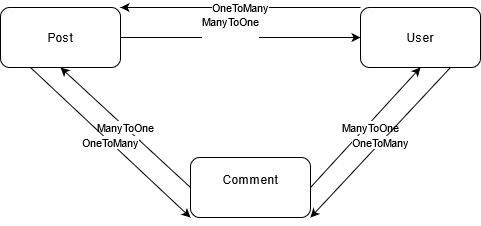

#Run 

`php -S 0.0.0.0:8000`

### Quelles sont les fonctionnalités principales du Symfony CLI ?

Création de projets 
Configuation de symfony
### Quelles relations existent entre les entités (Many To One/Many To Many/...) ? Faire un schéma de la base de données.

# Connexion à la base #

La configuration de la base de données ce fait dans le ficher .env
Il faut decommenter sqllite car la configuration de base utilise une base postgressql

# Administration 
•	Sonata est un bundle très riche en fonctionnalités. Ces dernières ne sont néanmoins pas toutes documentées. De ce fait, l’outil reste assez complexe lorsque l’on débute.
•	EasyAdmin est, quant à lui, un peu plus limité en features. Il est cependant très simple d’utilisation et possède une documentation très complète.

Pour récapituler : EasyAdmin cible principalement les applications simples et de petite ou moyenne envergure (un site de news, un blog, des petits sites marchands, etc.).
Il est préférable d’utiliser Sonata si votre application comporte d'innombrables règles de gestion et de sécurité (un domaine qu’EasyAdmin ne maîtrise pas encore).

### Installation/Configuration Easy Admin

`composer require easycorp/easyadmin-bundle`

`php bin/console make:admin:dashboard`

`symfony console make:admin:crud`

#### Pourquoi doit-on implémenter des méthodes to string dans nos entités? 

Pour que l'interface des CRUD controllers de Easy Admin sachent quoi afficher pour identifier l'objet

`AssociationField::new('author')`

#### Controlleurs

`composer require twig`

`symfony console make:controller`

#### params converter

The @ParamConverter annotation calls converters to convert request parameters to objects. These objects are stored as request attributes and so they can be injected as controller method arguments:

The Doctrine Converter attempts to convert request attributes to Doctrine entities fetched from the database. Several different approaches are possible:

A partir de l'id passé dans le chemin du route, le params converter s'occupe de recuperer l'objet doctrine

### form 

`composer require symfony/form`

forms symfony est un utilitaire puissant pour réaliser des formulaires html 

    Build the form in a Symfony controller or using a dedicated form class;
    Render the form in a template so the user can edit and submit it;
    Process the form to validate the submitted data, transform it into PHP data and do something with it (e.g. persist it in a database).

### Quels avantages offrent l'usage d'un formulaire ? 

Pas besoin de créer le formulaire en html, symfony s'en charge ainsi que le mapping, la gestion de la validation ... c'est plus simple 

### Bootstrap

`composer require symfony/webpack-encore-bundle`

`npm install -g yarn`